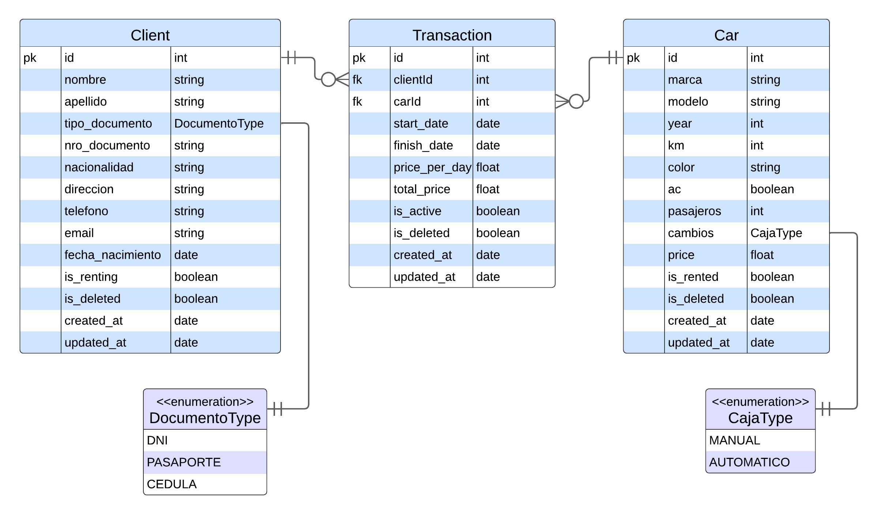

## Description
Rest API for car rental app.  
CRUD operations for Transactions, Cars and Clients.

Brief comment on business logic:  
Transactions are recorded based on the entry/exit of cars.  
When a car and a customer exit, both resources are flagged with a boolean (is_rented, is_renting) to disable them for future transactions until the ongoing transaction is completed, and then they are re-enabled. 

It doesn't align with calendar-based planning and/or combinatorial booking/logic of reservations/dates.  
It's designed to function in real-time within the office.  

It's similar to the check-in/check-out process of items from a warehouse.  
Clients can only rent one car at a time.

## Techs used
- Nest.js
- Prisma as ORM
- Cloud Postgres db in Supabase for the live version
- Local db instance with Docker to run locally and to run e2e tests

## Live deploys to see UI and interaction:
- Frontend: https://frontend-car-rental-ivory.vercel.app/
- API: https://car-rental-api.adaptable.app/api/clients

(Obs: The free tier goes to sleep after a while, and the first load may take a few seconds.)

## API docs and Endpoints
Full docs with body requests and responses.  
🡆 API Docs: https://car-rental-api.adaptable.app/docs

### API Endpoints:
Basic routes, for more info see the previous link
| Resource     | HTTP Method | Endpoint                       | Description                                |
|:------------:|-------------|--------------------------------|--------------------------------------------|
|     Cars     | POST        | /api/car                       | Create a new car                           |
|              | GET         | /api/car                       | Get a list of cars                         |
|              | GET         | /api/car/{id}                  | Get details of a specific car by ID        |
|              | PATCH       | /api/car/{id}                  | Update specific details of a car by ID     |
|              | DELETE      | /api/car/{id}                  | Delete a specific car by ID                |
|--------------|-------------|--------------------------------|--------------------------------------------|
|   Clients    | POST        | /api/clients                   | Create a new client                        |
|              | GET         | /api/clients                   | Get a list of clients                      |
|              | GET         | /api/clients/{id}              | Get details of a specific client by ID     |
|              | PATCH       | /api/clients/{id}              | Update specific details of a client by ID  |
|              | DELETE      | /api/clients/{id}              | Delete a specific client by ID             |
|--------------|-------------|--------------------------------|--------------------------------------------|
| Transactions | POST        | /api/transactions              | Create a new transaction                   |
|              | GET         | /api/transactions              | Get a list of all transactions             |
|              | GET         | /api/transactions?active=true  | Get a list of active transactions only                |
|              | GET         | /api/transactions/{id}         | Get details of a specific transaction by ID|
|              | PUT         | /api/transactions/{id}         | Replace a specific transaction by ID       |
|              | PATCH       | /api/transactions/{id}         | Finish a transaction and free the associated car and client|


## Running locally
You need to have installed Docker, to run a local postgres database
```bash
# clone repo and install dependencies
$ git clone --single-branch --branch development https://github.com/nico-bt/backend-car-rental-API.git
$ npm install

# Start local database with docker
$ npm run db:start

# Start the app
$ npm run start:dev

# Once you finish, to put down container:
# (will terminate both dev and test databases)
$ docker compose down
```

## Tests

```bash
# unit tests
$ npm run test

# e2e tests
# You need the local database running of the previous step
# If it is running do nothing, else run "npm run db:start" first
$ npm run test:e2e
```

## Entity Relationship Diagram

